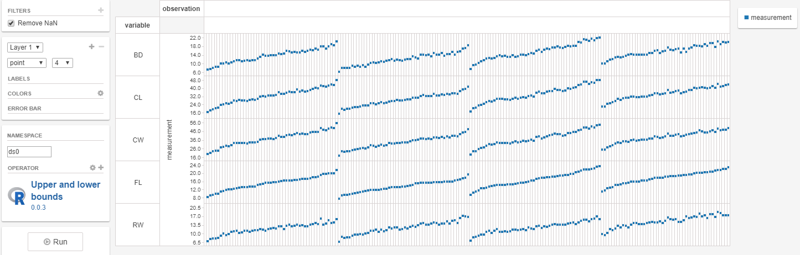

# upperandlowerbounds

#### Description

`upperandlowerbounds` operator computes an upper and lower bound values as a fraction of a given data point.

##### Usage
Input projection|.
---|---
`y-axis`             | is the input data for the multiplication per cell

Input parameters|.
---|---
`fraction`           | numeric, fraction value
`percentage`         | boolean, the relative values are returned as percentages

Output relations|.
---|---
`upperbound_absolute`| numeric, upper absolute bound value
`lowbound_absolute`  | numeric, lower absolute bound value
`upperbound_relative`| numeric, upper relative bound value
`lowbound_relative`  | numeric, lower relative bound value

##### Details
The operator takes the mean value of a cell and calculates an upper bound and a lowerbound.
The computation is done per cell. There are four values colculated and returned for each of the input cell.

The operator takes the mean value and calculates an upper bound by adding to it
```
  upperbound_absolute = value + (value * fraction)
  lowerbound_absolute = value + (value * fraction)
  
  upperbound_relative = (value * fraction)
  lowerbound_relative = (value * fraction)
```
Use this operator when wanting to determine upper and lower bounds. These generated bounds are usually used in a downstream data step for a graphics representation using grid lines which correspond to the boundary values (see horizontal grid lines feature)


#### References




##### See Also


#### Examples
